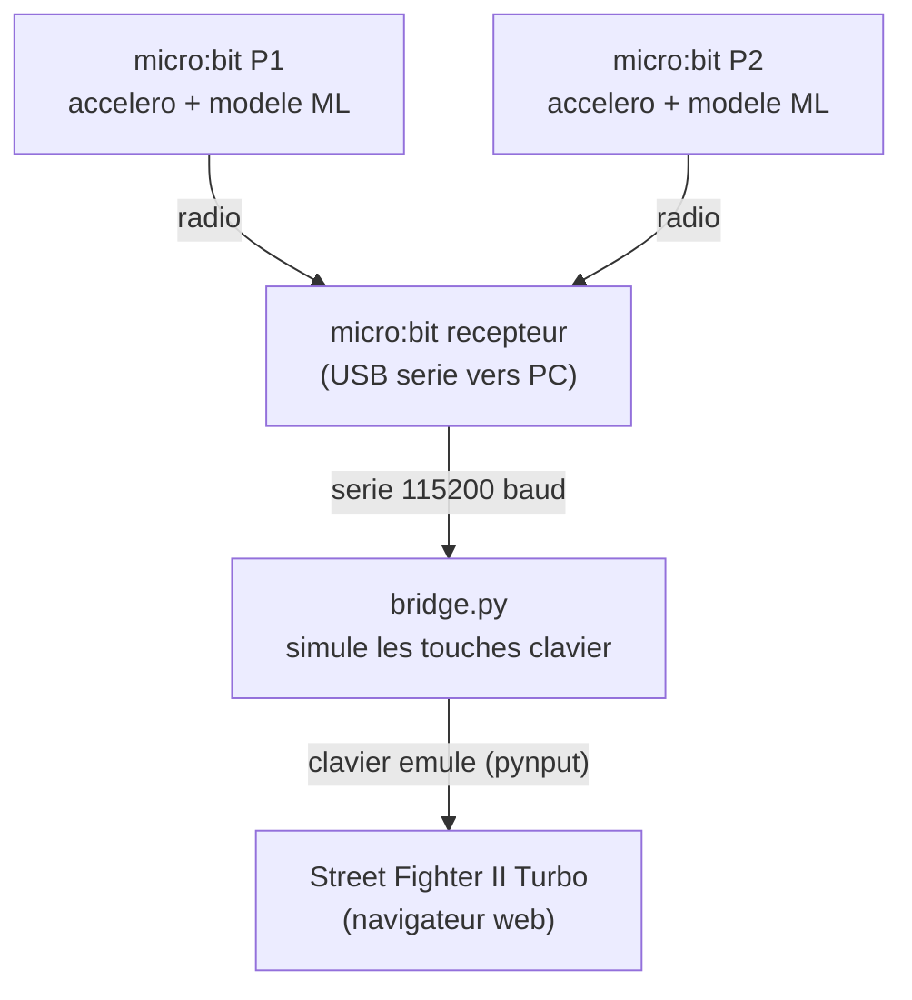

# Street Fighter II x micro:bit — Atelier IA & Gestes

Transforme des micro:bit en manettes de jeu pour Street Fighter II en utilisant le **machine learning** (sous-domaine de l'intelligence artificielle). Les eleves entrainent un modele de reconnaissance de gestes (accelerometre) sur [CreateAI](https://createai.microbit.org/), puis jouent a deux avec leurs micro:bit comme controleurs.



## Objectifs pedagogiques

- **Decouvrir le machine learning** : collecter des donnees, entrainer un modele, tester et iterer
- **Comprendre l'importance des donnees** : un modele n'est aussi bon que les donnees d'entrainement. Peu de samples = mauvaise reconnaissance. Gestes trop similaires = confusion. Les eleves experimentent directement l'impact de la qualite et la quantite des donnees
- **Prototyper un systeme complet** : capteur → IA → communication radio → logiciel → application concrete
- **Travailler en equipe** : chaque binome gere son modele, ses gestes, ses touches

## Setup

### Materiel

- 3 micro:bit V2 (2 emetteurs + 1 recepteur)
- 1 cable USB pour le recepteur
- 1 PC avec Python 3 et un navigateur web

### Installation

```bash
# Cloner le projet
cd serial-game

# Installer les dependances Python
pip install -r requirements.txt

# Lancer le bridge
python bridge.py

# Ouvrir le jeu dans le navigateur
# https://freebie.games/games/street-fighter-ii-turbo/play/
```

### Flasher les micro:bit

1. **Emetteurs (joueurs)** : ouvrir [CreateAI](https://createai.microbit.org/), entrainer un modele avec les gestes souhaites, exporter le `.hex` et le flasher sur le micro:bit
2. **Recepteur** : copier le code de `microbit_receiver.js` dans [MakeCode](https://makecode.microbit.org/), compiler et flasher

## Ressources

### Fichiers du projet

| Fichier                        | Role                                                                                                                                                                         |
| ------------------------------ | ---------------------------------------------------------------------------------------------------------------------------------------------------------------------------- |
| `bridge.py`                    | Bridge serie → clavier. Lit le port USB et simule les touches                                                                                                                |
| `macros.py`                    | Coups speciaux : toutes les macros de combos par personnage (voir liste ci-dessous)                                                                                          |
| `microbit_receiver.js`         | Firmware du micro:bit recepteur (MakeCode). Recoit la radio et transmet en serie                                                                                             |
| `microbit-stf2-player-1.js`    | Exemple de code emetteur joueur 1 (reference)                                                                                                                                |
| `microbit-stf2-player-2.js`    | Exemple de code emetteur joueur 2 (reference)                                                                                                                                |
| `microbit-stf2-player-1-f.hex` | Firmware joueur 1 pret a flasher (code + modele ML + echantillons d'entrainement). Reimportable dans [CreateAI](https://createai.microbit.org/) pour voir/modifier le modele |
| `microbit-stf2-player-2-f.hex` | Firmware joueur 2 pret a flasher (code + modele ML + echantillons d'entrainement). Reimportable dans [CreateAI](https://createai.microbit.org/) pour voir/modifier le modele |
| `combo.png`                    | Liste des combos Street Fighter II                                                                                                                                           |
| `touches manettes.pdf`         | Reference des touches par manette                                                                                                                                            |

### Liens

- [CreateAI micro:bit](https://createai.microbit.org/) — entrainement du modele ML
- [Street Fighter II Turbo](https://freebie.games/games/street-fighter-ii-turbo/play/) — le jeu dans le navigateur
- [MakeCode micro:bit](https://makecode.microbit.org/) — editeur pour le firmware recepteur

## Fonctionnement

### 1. Reconnaissance de gestes (micro:bit emetteur)

Chaque micro:bit emetteur embarque un modele ML entraine sur [CreateAI](https://createai.microbit.org/). L'accelerometre detecte les mouvements et le modele classifie le geste en temps reel. Le resultat est envoye par radio :

```
Geste detecte → modele ML → radio.sendString("left")
```

### 2. Reception et relais (micro:bit recepteur)

Le micro:bit recepteur branche en USB recoit les messages radio des deux joueurs. Il identifie chaque joueur par son numero de serie et transmet sur le port serie :

```
radio.onReceivedString → serial.writeLine("P1:left")
```

### 3. Bridge Python (PC)

`bridge.py` lit le port serie, decode les commandes et simule les touches clavier correspondantes avec `pynput`. Le jeu dans le navigateur recoit les inputs comme si c'etait un vrai clavier.

### Touches par defaut

**Joueur 1** — touches directionnelles + `z` (poing) / `x` (pied)

**Joueur 2** — `u`/`j`/`h`/`k` (directions) + `m` (poing) / `l` (pied)

Les macros (coups speciaux) sont definies dans `macros.py` et executent automatiquement la sequence de touches du combo. Pour declencher un coup special, le micro:bit envoie le mot-cle par radio (ex: `radio.sendString("hadouken")`).

### Mots-cles de coups speciaux

| Personnage | Mot-cle | Input |
|---|---|---|
| **Ryu / Ken** | `hadouken` | ↓ ↘ → + poing |
| | `shoryuken` | → ↓ ↘ + poing |
| | `tatsumaki` | ↓ ↙ ← + pied |
| **Guile** | `sonic_boom` | ← (charge) → + poing |
| | `flash_kick` | ↓ (charge) ↑ + pied |
| **E. Honda** | `hundred_hand` | poing rapide |
| | `sumo_headbutt` | ← (charge) → + poing |
| | `sumo_smash` | ↓ (charge) ↑ + pied |
| **Blanka** | `electricity` | poing rapide |
| | `rolling_h` | ← (charge) → + poing |
| | `rolling_v` | ↓ (charge) ↑ + pied |
| **Dhalsim** | `yoga_fire` | ↓ ↘ → + poing |
| | `yoga_flame` | ← ↙ ↓ ↘ → + poing |
| | `yoga_teleport` | → ↓ ↘ + poing |
| **Zangief** | `lariat` | poing rapide |
| | `pile_driver` | 360° + poing |
| **Balrog** | `turn_punch` | maintien poing 2s |
| | `dash_punch` | ← (charge) → + poing |
| **Vega** | `claw_dive` | ↓ (charge) ↑ + pied |
| | `wall_leap` | ← (charge) → + pied |
| | `claw_roll` | ← (charge) → + poing |
| **Sagat** | `tiger_shot` | ↓ ↘ → + poing |
| | `tiger_uppercut` | → ↓ ↘ + poing |
| | `tiger_knee` | ↓ ↘ → ↗ + pied |
| **Chun-Li** | `lightning_kick` | pied rapide |
| | `spinning_bird` | ↓ (charge) ↑ + pied |
| | `kikoken` | ← (charge) → + poing |
| **M. Bison** | `psycho_crusher` | ← (charge) → + poing |
| | `scissor_kick` | ← (charge) → + pied |
| | `head_stomp` | ↓ (charge) ↑ + pied |

## Atelier

### Deroulement suggere

1. **Decouverte** — presenter le projet, montrer une demo avec les manettes pretes
2. **Entrainement du modele** — chaque binome cree son modele sur CreateAI avec les gestes de base (haut, bas, gauche, droite, repos)
3. **Premier test** — flasher, jouer, constater ce qui marche et ce qui ne marche pas
4. **Iteration** — ameliorer le modele : ajouter des samples, ajuster les gestes, ajouter des actions (attaques, combos)
5. **Tournoi** — matchs entre les equipes

### Pistes d'amelioration pour les eleves

- **Ajouter des boutons** : utiliser les boutons A/B du micro:bit pour les attaques au lieu de gestes, combiner boutons + accelerometre
- **Ameliorer le modele** : ajouter plus d'echantillons par geste, tester avec differentes personnes, identifier les gestes que le modele confond et les rendre plus distincts
- **Ajouter des gestes** : creer de nouveaux mouvements pour de nouvelles actions (saut + attaque, esquive, combo special)
- **Comprendre les limites** : que se passe-t-il avec trop peu de donnees ? Avec des gestes trop similaires ? Pourquoi le modele se trompe-t-il parfois ?

### Discussion sur l'IA et les donnees

L'atelier permet d'aborder concretement :

- **Biais des donnees** : si un seul eleve enregistre les gestes, le modele ne fonctionnera pas bien pour les autres. Les donnees doivent etre representatives
- **Quantite vs qualite** : 5 samples nets valent mieux que 50 samples brouillons
- **Iteration** : un modele d'IA n'est jamais "fini", on l'ameliore en boucle (collecter → entrainer → tester → corriger)
- **Boite noire vs comprehension** : le modele fait des erreurs — comment les diagnostiquer ? L'IA n'est pas magique, elle depend entierement de ce qu'on lui donne
