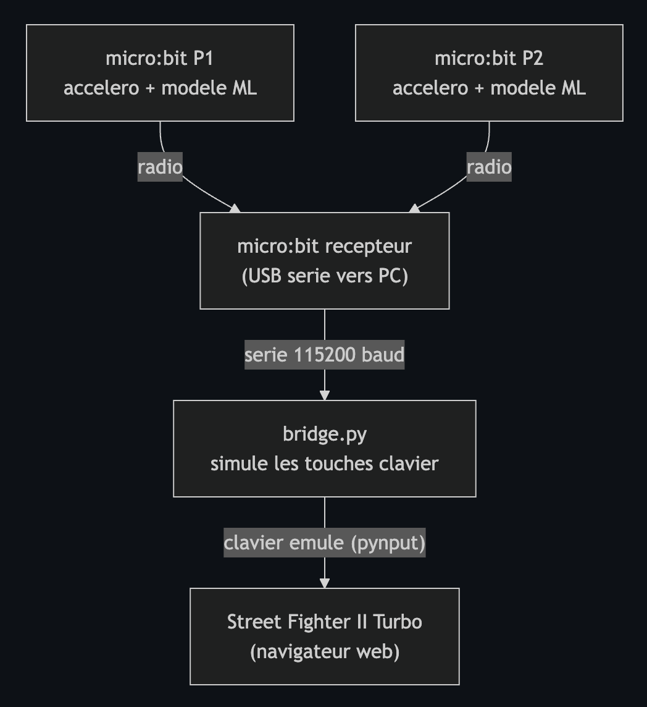
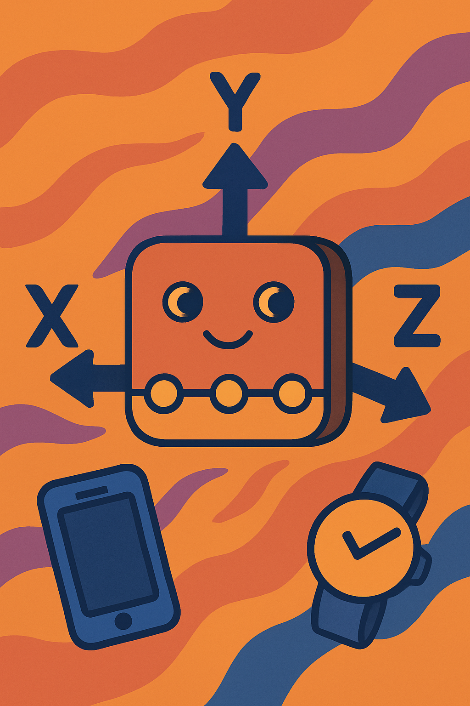
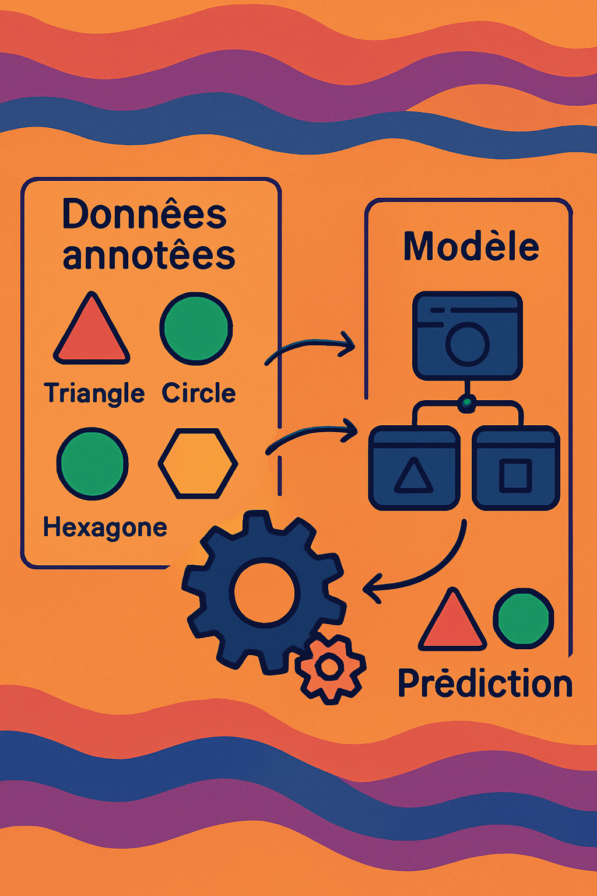
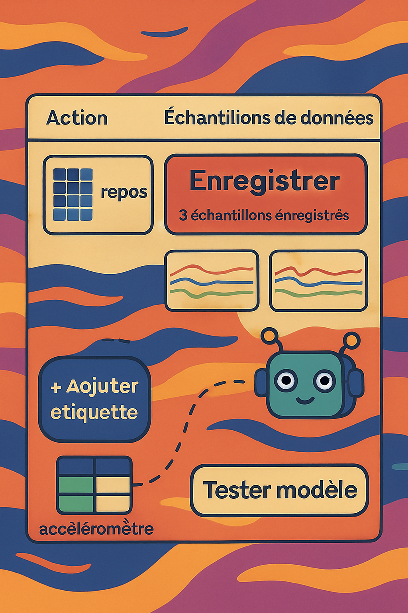

## Machine learning 

1. **Présentation Installation** 

2. **IA & Machine Learning** 

3. **Projet** 

4. **Quizz** 

---

## Installation

### Ou est qui ?

### Qui fait quoi ?

---

## Intelligence Artificielle

#### Qu'est-ce que l'IA ? 
<!-- 
Le Parlement européen, quant à lui, définit l'intelligence artificielle comme tout outil utilisé par une machine capable de "reproduire des comportements liés aux humains, tels que le raisonnement, la planification et la créativité".

- Reconnaissance vocale (Siri, Alexa)
- Reconnaissance d'image (Google Photos)
- Traduction automatique (Google Translate)
- Chatbots (service client)
- Recommandations (Netflix, Spotify)
- Détection de spam
- Voitures autonomes -->

#### Le Machine Learning ?
<!-- Machine Learning (ML) est une sous-catégorie de l'IA qui permet aux machines d'apprendre à partir de données.  
!-->
#### Le rapport avec Street Fighter ?

---

## L'accéléromètre

Capteur qui mesure l'**accélération** dans 3 dimensions :
- **X** : gauche/droite
- **Y** : avant/arrière  
- **Z** : haut/bas

#### Où en trouve-t-on ?
<!-- Smartphone, tablette, manette de jeu, voiture (airbag), montres connectées -->
---

## ML : Apprentissage supervisé

<!-- 

L'apprentissage supervisé est une méthode où l'on entraîne un modèle avec des données étiquetées afin qu'il puisse faire des prédictions sur de nouvelles données. -->

1. **Collecte de données** 
2. **Annotation des données**
3. **Entraînement du modèle**
4. **Test du modèle** 
5. **Utilisation du modèle pour prédire**

---

## Create AI: A vous de jouer

#### Entraine le modele pour detecter:

- Gauche
- Droite
- Haut
- Bas
- Repos / Rien

